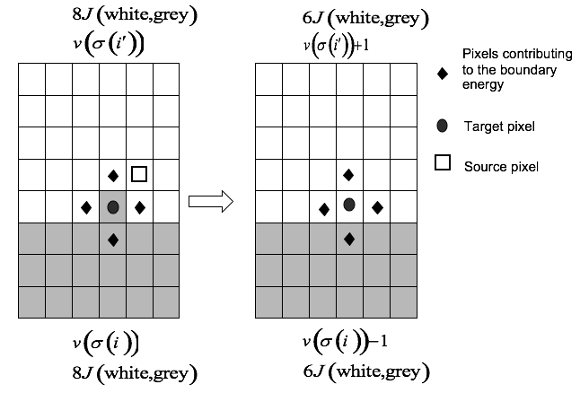
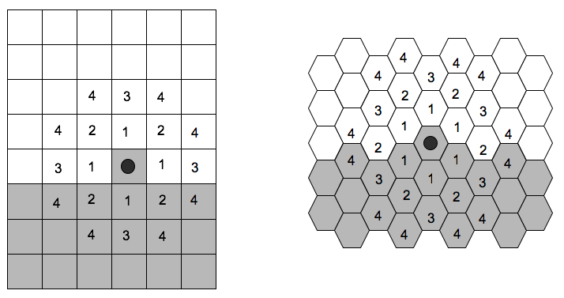
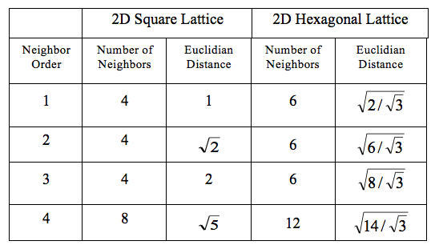

Algorithmic Implementation of Effective-Energy Calculations
------------------------------------------------------------

Consider an effective energy consisting of boundary-energy and volume-constraint terms as in equation :eq:`(6)`. After choosing the source (:math:`i'`) and destination (:math:`i`) pixels (the cell index of the source will overwrite the target pixel if the index copy is accepted), we calculate the change in the effective energy that would result from the copy. We evaluate the change in the boundary energy and volume constraint as follows. First we visit the target pixel’s neighbors (:math:`i^n`). If the neighbor pixel belongs to a different generalized cell from the target pixel, *i.e.*, when :math:`\sigma(i^n) \neq \sigma(i)` (see :eq:`(1)`), we decrease :math:`\Delta H` by :math:`J(\tau(\sigma(i)), \tau(\sigma(i^n)))`. If the neighbor belongs to a cell different from the source pixel (:math:`i'`) we increase :math:`\Delta H` by :math:`J(\tau(\sigma(i')), \tau(\sigma(i^n)))`.

The change in volume-constraint energy is evaluated according to:

.. math::
   :nowrap:

   \begin{eqnarray}
   \Delta H_{vol} & = & \Delta H_{vol}^{new} - \Delta H_{vol}^{old} \\

   & = & \lambda_{vol}[(v(\sigma(i')) + 1 - V_t(\sigma(i')))^2 + (v(\sigma(i)) - 1 - V_t(\sigma(i)))^2] - \lambda_{vol}[(v(\sigma(i')) - V_t(\sigma(i')))^2 + (v(\sigma(i)) - V_t(\sigma(i)))^2] \\

   & = & [{1+2(v(\sigma(i')) - V_t(\sigma(i')))}+{1-2(v(\sigma(i)) - V_t(\sigma(i)))}]

   \end{eqnarray}

where :math:`v(\sigma(i')` and :math:`v(\sigma(i)` denote the volumes of the generalized cells containing the source and target pixels, respectively.

In this example, we could calculate the change in the effective energy locally, *i.e.*, by visiting the neighbors of the target of the index copy. Most effective energies are quasi-local, allowing calculations of :math:`\Delta H`  similar to those presented above. The locality of the effective energy is crucial to the utility of the GGH approach. If we had to calculate the effective energy for the entire cell lattice for each index-copy attempt, the algorithm would be prohibitively slow.

    **Figure 3:** Calculating changes in the boundary energy and the volume-constraint energy on a nearest-neighbor square lattice.

For longer-range interactions we use the appropriate list of neighbors, as shown in Figure 4 and Table 1. Longer-range interactions are less anisotropic but result in slower simulations.

    **Figure 4:** Locations of :math:`n^{th}` -nearest neighbors on a 2D square lattice and a 2D hexagonal lattice.

    **Table 1:** Multiplicity and Euclidian distances of :math:`n^{th}`-nearest neighbors for 2D square and hexagonal lattices. The number of :math:`n^{th}` neighbors and their distances from the central pixel differ in a 3D lattice. CompuCell3D calculates distance between neighbors by setting the volume of a single pixel (whether in 2D or 3D) to 1.
