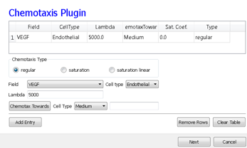

Angiogenesis Model
---------------------

Vascular development is central to both development and cancer progression. We present a simplified model of the earliest phases of capillary network assembly by endothelial cells based on cell adhesion and contact-inhibited chemotaxis. This model does a good job of reproducing the patterning and dynamics which occur if we culture Human Umbilical Vein Endothelial Cells (*HUVEC*) on matrigel in a quasi-2D *in vitro* experiment (Merks and Glazier 2006, Merks et al., 2006, 2008). In addition to generalized cells modeling the HUVEC, we will need a diffusing chemical object, here, Vascular Endothelial Growth Factor (*VEGF*), cell secretion of VEGF and cell-contact-inhibited chemotaxis to VEGF.

We will use a 3D voxel (pixel) with a side of 4 µm, i.e. a volume of 64 µm\ :sup:`3`\. Since the experimental HUVEC speed is about 0.4 µm/min and cells in this simulation move at an average speed of 0.1 pixel/MCS, one MCS represents one minute.

In the Simulation Wizard, we name the model ``ANGIOGENESIS``, set the cell- and field-lattice dimensions to 50×50×50, the membrane fluctuation amplitude to 20, the pixel-copy range to 3, the number of MCS to 10000 and select ``BlobFieldInitializer`` to produce the initial cell-lattice configuration. We have only one cell type – ``Endothelial``.

In the ``Chemical Fields`` page we create the ``VEGF`` field and select ``FlexibleDiffusionSolverFE`` from the ``Solver`` pull-down list.

    **Figure 12.:** Specification of the angiogenesis chemical field in Simulation Wizard

Next, on the ``Cell Properties`` and ``Behaviors`` page, we select the ``Contact`` module from the ``Adhesion-behavior`` group and add ``Secretion``, ``Chemotaxis`` and ``Volume-constraint`` behaviors by checking the appropriate boxes.

    **Figure 13.:** Specification of angiogenesis cell behaviors in Simulation Wizard

Because we have invoked ``Secretion`` and ``Chemotaxis``, the Simulation Wizard opens their configuration screens. On the ``Secretion`` page, from the pull-down list, we select the chemical to secrete by selecting ``VEGF`` in the ``Field`` pull-down menu and the cell type secreting the chemical (``Endothelial``), and enter the rate of 0.013 (50 pg (cell h)\ :sup:`-1`\ = 0.013 pg (voxel MCS)\ :sup:`-1`\, compare to Leith and Michelson 1995). We leave the ``Secretion Type`` entry set to ``Uniform``, so each pixel of an endothelial cell secretes the same amount of ``VEGF`` at the same rate. Uniform volumetric secretion or secretion at the cell’s center of mass may be most appropriate in 2D simulations of planar geometries (e.g. cells on a petrie dish or agar) where the biological cells are actually secreting up or down into a medium that carries the diffusant. CC3D also supplies a secrete-on-contact option to secrete outwards from the cell boundaries and allows specification of which boundaries can secrete, which is more realistic in 3D. However, users are free to employ any of these methods in either 2D or 3D depending on their interpretation of their specific biological situation. CompuCell3D does not have intrinsic units for fields, so the amount of a chemical can be interpreted in units of moles, number of molecules or grams. We click the ``Add Entry`` button to add the secretion information, then proceed to the next page to define the cells’ chemotaxis properties.

.. figure:: images/fig14_spec_angiogenesis_secretion_param_wizard.png
    :align: center
    :height: 100px
    :alt: Figure14 Specification of angiogenesis secretion parameters in Simulation Wizard
    :figclass: align-center

    **Figure 14.:** Specification of angiogenesis secretion parameters in Simulation Wizard

On the ``Chemotaxis`` page, we select ``VEGF`` from the ``Field`` pull-down list and ``Endothelial`` for the cell type, entering a value for ``Lambda`` of 5000. When the ``chemotaxis`` type is ``regular``, the cell’s response to the field is linear, i.e. the effective strength of chemotaxis depends on the product of ``Lambda`` and the secretion rate of ``VEGF``, e.g. a ``Lambda`` of 5000 and a ``secretion rate`` of 0.013 has the same effective chemotactic strength as a ``Lambda`` of 500 and a ``secretion rate`` of 0.13. Since endothelial cells do not chemotax at surfaces where they contact other endothelial cells (contact-inhibition), we select ``Medium`` from the pull-down menu next to the ``Chemotax Towards`` button and click this button to add ``Medium`` to the list of generalized cell types whose interfaces with ``Endothelial`` cells support chemotaxis. We click the ``Add Entry`` button to add the chemotaxis information, then proceed to the final Simulation Wizard page.

    **Figure 15.:** Specification of angiogenesis chemotaxis properties in Simulation Wizard

Next, we adjust the parameters of the draft model. Pressure from chemotaxis to VEGF reduces the average endothelial-cell volume by about 10 voxels from the target volume. So, in the ``Volume`` plugin we set ``TargetVolume`` to 74 (64+10) and ``LambdaVolume`` to 20.0.
In experiments, in the absence of chemotaxis no capillary network forms and cells adhere to each other to form clusters. We therefore set J\ :sub:`MM`\ =0, J\ :sub:`EM`\ =12 and J\ :sub:`EE`\ =5 in the ``Contact`` plugin (``M: Medium, E: Endothelial``). We also set the ``NeighborOrder`` for the ``Contact`` energy calculations to 4.

The diffusion equation that governs VEGF ( :math:`V(x)`) field evolution is:

.. math:: {\delta V(\vec{x}) \over{\delta t}} = D^{EC}_{VEGF} \bigtriangledown^2 V(\vec{x}) - \gamma_{VEGF} V(\vec{x}) \delta(\tau(\sigma(\vec{x}), M) + S^{EC} \delta(\tau(\sigma(\vec{x})), EC)

where, :math:`\delta(\tau(\sigma(\vec{x})), EC)=1` inside ``Endothelial`` cells and 0 elsewhere and  :math:`\delta(\tau(\sigma(\vec{x}), M)=1` inside ``medium`` and 0 elsewhere. We set the diffusion constant  :math:`D_{VEGF}=0.042 µm^2/sec` (0.16 voxel :sup:`2`/MCS, about two orders of magnitude smaller than experimental values),  the decay coefficient :math:`\gamma_{VEGF} =1 h^{-1}` [130,131] (0.016 MCS-1) for Medium pixels and  :math:`\gamma_{VEGF}=0` inside Endothelial cells, and the secretion rate   :math:`S^{EC}=0.013` pg (voxel MCS):sup:`-1`.
In the CC3DML script describing ``FlexibleDiffusionSolverFE`` (Listing 2, lines 38-47) we set the values of the ``<DiffusionConstant>`` and ``<DecayConstant>`` tags to 0.16 and 0.016 respectively. To prevent chemical decay inside Endothelial cells we add the line ``<DoNotDecayIn>Endothelial</DoNotDecayIn>`` inside the ``<DiffusionData>`` tag pair.
Finally, we edit ``BlobInitializer`` (lines 49-56) to start with a solid sphere 10 pixels in radius centered at x=25, y=25, z=25 with initial cell width 4, as following-

.. code-block:: xml
   :linenos:

     <CompuCell3D version="3.6.0">

     <Potts>
      <Dimensions x="50" y="50" z="50"/>
      <Steps>10000</Steps>
      <Temperature>20.0</Temperature>
      <NeighborOrder>3</NeighborOrder>
     </Potts>

     <Plugin Name="CellType">
      <CellType TypeId="0" TypeName="Medium"/>
      <CellType TypeId="1" TypeName="Endothelial"/>
     </Plugin>

     <Plugin Name="Volume">
      <VolumeEnergyParameters CellType="Endothelial"
         LambdaVolume="20.0" TargetVolume="74"/>
     </Plugin>

     <Plugin Name="Contact">
      <Energy Type1="Medium" Type2="Medium">0</Energy>
      <Energy Type1="Medium" Type2="Endothelial">12</Energy>
      <Energy Type1="Endothelial" Type2="Endothelial">5</Energy>
      <NeighborOrder>4</NeighborOrder>
     </Plugin>

     <Plugin Name="Chemotaxis">
      <ChemicalField Name="VEGF" Source="FlexibleDiffusionSolverFE">
       <ChemotaxisByType ChemotactTowards="Medium" Lambda="5000.0"
          Type="Endothelial"/>
      </ChemicalField>
     </Plugin>

     <Plugin Name="Secretion">
      <Field Name="VEGF">
       <Secretion Type="Endothelial">0.013</Secretion>
      </Field>
     </Plugin>

     <Steppable Type="FlexibleDiffusionSolverFE">
      <DiffusionField>
       <DiffusionData>
        <FieldName>VEGF</FieldName>
        <DiffusionConstant>0.16</DiffusionConstant>
        <DecayConstant>0.016</DecayConstant>
        <DoNotDecayIn> Endothelial</DoNotDecayIn>
       </DiffusionData>
      </DiffusionField>
     </Steppable>

     <Steppable Type="BlobInitializer">
     <Region>
     

       <Radius>10</Radius>
       <Width>4</Width>
       <Types>Endothelial</Types>
     </Region>
     </Steppable>

     </CompuCell3D>

**Listing 2:** CC3DML code for the angiogenesis model.

The main behavior that drives vascular patterning is contact-inhibited chemotaxis (Listing 2, lines 26-30). VEGF diffuses away from cells and decays in ``Medium``, creating a steep concentration gradient at the interface between ``Endothelial`` cells and ``Medium``. Because ``Endothelial`` cells chemotax up the concentration gradient only at the interface with ``Medium`` the ``Endothelial`` cells at the surface of the cluster compress the cluster of cells into vascular branches and maintain branch integrity.
We show screenshots of a simulation of the angiogenesis model in Figure 16 [Merks et al., 2008, Shirinifard et al., 2009]. We can reproduce either 2D or 3D primary capillary network formation and the rearrangements of the network agree with experimentally-observed dynamics. If we eliminate the contact inhibition, the cells do not form a branched structure (as observed in chick allantois experiments, Merks et al., 2008). We can also study the effects of surface tension, external growth factors and changes in motility and diffusion constants on the pattern and its dynamics. However, this simple model does not include the strong junctions HUVEC cells make with each other at their ends after a period of prolonged contact. It also does not attempt to model the vacuolation and linking of vacuoles that leads to a connected network of tubes.

.. figure:: images/fig16_initial_cluster_adhering_endothelial_cells.png
    :align: center
    :height: 150px
    :alt: Figure16 An initial cluster of adhering endothelial cells forms a capillary-like network via sprouting angiogenesis
    :figclass: align-center

    **Figure 16.:** An initial cluster of adhering endothelial cells forms a capillary-like network via sprouting angiogenesis. A: 0 hours (0 MCS), B: ~2 hours (100 MCS), C: ~5 hours (250 MCS), D: ~18 hours (1100 MCS).

Since real endothelial cells are elongated, we can include the ``Cell-elongation`` plugin in the Simulation Wizard to better reproduce individual cell morphology. However, excessive cell elongation causes cell fragmentation. Adding either the ``Global`` or ``Fast Connectivity Constraint`` plugin prevents cell fragmentation.
