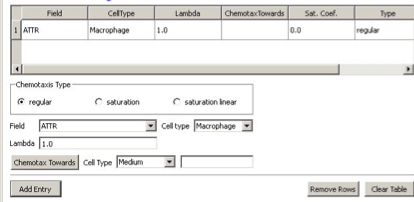
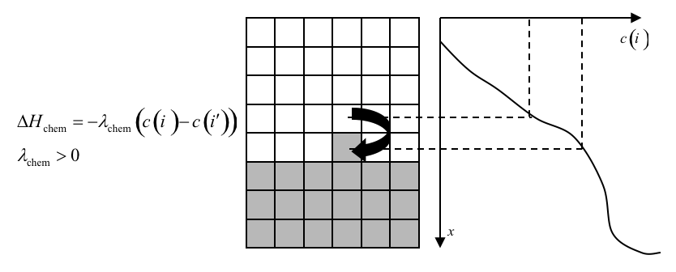
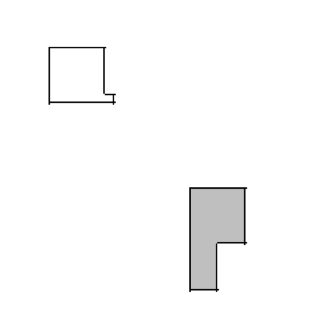
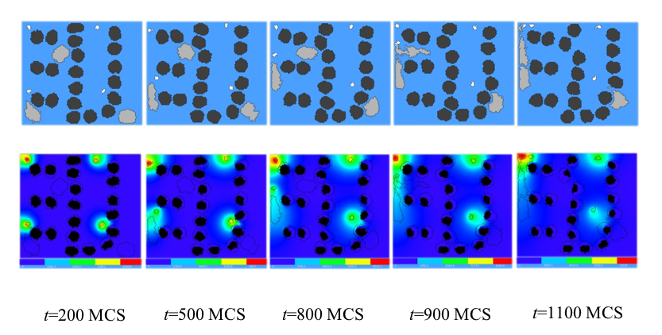

Bacterium-and-Macrophage Simulation
--------------------------------------

Another example which illustrates the use of chemical fields is based on the *in vitro* behavior of bacteria and macrophages in blood. In the famous experimental movie taken in the 1950s by David Rogers at Vanderbilt University, the macrophage appears to chase the bacterium, which seems to run away from the macrophage. We can model both behaviors using cell secretion of diffusible chemical signals and movement of the cells in response to the chemical (*chemotaxis*): the bacterium secretes a signal (a *chemoattractant*) that attracts the macrophage and the macrophage secretes a signal (a *chemorepellant*) which repels the bacterium (97). The basic procedure to construct the simulation is very similar to the one we followed in constructing angiogenesis model.

In Twedit++-CC3D we open new project and name it bacterium_macrophage. We declare 3 cell types – Bacterium, Macrophage and Red (red blood cells). We assume that diffusing chemoattractant is secreted by bacteria, therefore on the Chemical Field page of the Simulation Wizard we declare ATTR chemical field which we will solve using DiffusionSolverFE. On the Cell Behaviors and Properties page we select Contact, Chemotaxis, VolumeFlex and Surface Flex. Clicking ‘Next’ button brings us to chemotaxis page where we set chemotaxis parameters as shown on Figure 17:

    **Figure 17.:** Setting up chemotaxis properties forMacrophages

After code-autogenerating is done we have to do several adjustments to the CC3DML script.

.. code-block:: xml
   :linenos:

   <CompuCell3D version="3.6.2">

      <Potts>
         <Dimensions x="100" y="100" z="1"/>
         <Steps>10000</Steps>
         <Temperature>40.0</Temperature>
         <NeighborOrder>2</NeighborOrder>
         <Boundary_x>Periodic</Boundary_x>
         <Boundary_y>Periodic</Boundary_y>
      </Potts>

      <Plugin Name="CellType">
         <CellType TypeId="0" TypeName="Medium"/>
         <CellType TypeId="1" TypeName="Bacterium"/>
         <CellType TypeId="2" TypeName="Macrophage"/>
         <CellType TypeId="3" TypeName="Red"/>
      </Plugin>

      <Plugin Name="Volume">
   <VolumeEnergyParameters CellType="Bacterium" LambdaVolume="60.0" TargetVolume="10"/>
         <VolumeEnergyParameters CellType="Macrophage" LambdaVolume="15.0" TargetVolume="150"/>
         <VolumeEnergyParameters CellType="Red" LambdaVolume="30.0" TargetVolume="100"/>
      </Plugin>

      <Plugin Name="Surface">
         <SurfaceEnergyParameters CellType="Bacterium" LambdaSurface="4.0" TargetSurface="10"/>
         <SurfaceEnergyParameters CellType="Macrophage" LambdaSurface="20.0" TargetSurface="50"/>
         <SurfaceEnergyParameters CellType="Red" LambdaSurface="0.0" TargetSurface="40"/>
      </Plugin>

      <Plugin Name="Contact">
         <Energy Type1="Medium" Type2="Medium">10.0</Energy>
         <Energy Type1="Medium" Type2="Bacterium">8.0</Energy>
         <Energy Type1="Medium" Type2="Macrophage">8.0</Energy>
         <Energy Type1="Medium" Type2="Red">30.0</Energy>
         <Energy Type1="Bacterium" Type2="Bacterium">150.0</Energy>
         <Energy Type1="Bacterium" Type2="Macrophage">15.0</Energy>
         <Energy Type1="Bacterium" Type2="Red">150.0</Energy>
         <Energy Type1="Macrophage" Type2="Macrophage">150.0</Energy>
         <Energy Type1="Macrophage" Type2="Red">150.0</Energy>
         <Energy Type1="Red" Type2="Red">150.0</Energy>
         <NeighborOrder>2</NeighborOrder>
      </Plugin>

      <Plugin Name="Chemotaxis">
         <ChemicalField Name="ATTR" Source="DiffusionSolverFE">
            <ChemotaxisByType Lambda="1.0" Type="Macrophage"/>
         </ChemicalField>
      </Plugin>

      <Steppable Type="DiffusionSolverFE">
         <DiffusionField>
            <DiffusionData>
               <FieldName>ATTR</FieldName>
               <GlobalDiffusionConstant>0.1</GlobalDiffusionConstant>
               <GlobalDecayConstant>5e-05</GlobalDecayConstant>
               <DiffusionCoefficient CellType="Red">0.0</DiffusionCoefficient>
            </DiffusionData>
            <SecretionData>
               <Secretion Type="Bacterium">100</Secretion>
            </SecretionData>
            <BoundaryConditions>
               <Plane Axis="X">
                  <Periodic/>
               </Plane>
               <Plane Axis="Y">
                  <Periodic/>
               </Plane>
            </BoundaryConditions>
         </DiffusionField>
      </Steppable>

      <Steppable Type="PIFInitializer">
         <PIFName>Simulation/bacterium_macrophage.piff</PIFName>
      </Steppable>

   </CompuCell3D>

**Listing 3:** CC3DML code for Bacterium Macrophage simulation. Note that the code has been modified from its autogenetrated  version

We implement the actual bacterium-macrophage “chasing” mechanism using the ``Chemotaxis`` plugin, which specifies how a generalized cell of a given type responds to a field. The ``Chemotaxis`` plugin biases a cell’s motion up or down a field gradient by changing the calculated effective-energy change used in the acceptance function, equation (7). For a field :math:`c(i)` :

.. math:: \Delta H_{chem} = - \lambda_{chem} (c(i) - c(i'))

where :math:`c(i)` is the chemical field at the index-copy target pixel, :math:`c(i')` the field at the index-copy source pixel, and :math:`\lambda_{chem}` the strength and direction of chemotaxis. If   :math:`\lambda_{chem}` and :math:`c(i) > c(i')` , then :math:`\Delta H_{chem}` is negative, increasing the probability of accepting the index copy in equation (7). The net effect is that the cell moves up the field gradient with a velocity :math:`~\lambda_{chem} \bigtriangledown c`. If :math:`\lambda < 0`  is negative, the opposite occurs, and the cell will move down the field gradient. Plugins with more sophisticated :math:`\Delta H_{chem}` calculations (e.g., including response saturation) are available within CompuCell3D (see the description of the chemotaxis plugin in the second part of  this manual).

    **Figure 18:** Connecting a field to GGH dynamics using a chemotaxis-energy term. The difference in the value of the field   at the source,  , and target,  , pixels changes the  of the index-copy attempt. Here   and  , so , increasing the probability of accepting the index-copy attempt in equation (7).

In the ``Chemotaxis`` plugin we must identify the names of the fields, where the field information is stored, the list of the generalized-cell types that will respond to the fields, and the strength and direction of the response (:math:`Lambda = \lambda_{chem}`). The information for each field is specified using the syntax:

.. code-block:: xml
   :linenos:

   <ChemicalField Source="where field is stored" Name="field name">
      <ChemotaxisByType Type="cell_type1" Lambda="lambda1"/>
      <ChemotaxisByType Type="cell_type2" Lambda="lambda1"/>
   </ChemicalField>

In our current example, the first field, named ``ATTR``, is stored in ``DiffusionSolverFE``. ``Macrophage`` cells are attracted to ``ATTR`` with :math:`\lambda_{chem}=1`. None of the other cell types responds to ``ATTR``. Similarly, ``Bacterium`` cells are repelled by ``REP`` with :math:`\lambda_{chem}=-0.1`.

Keep in mind that fields are not created within the ``Chemotaxis`` plugin, which only specifies how different cell types respond to the fields. We define and store the fields elsewhere. Here, we use the ``DiffusionSolverFE`` steppable as the source of our fields. The ``DiffusionSolverFE`` steppable is the main CompuCell3D tool for defining diffusing fields, which evolve according to the diffusion equation:

.. math:: {\delta c(i)\over{\delta t}} = D(i) \nabla^2c(i) - k(i)c(i)+s(i)

where :math:`c(i)` is the field concentration :math:`D(i)`, :math:`k(i)` and :math:`s(i)` denote the diffusion constant (in m:sup:`2`/s), decay constant (in s:sup:`-1`) and secretion rates (in concentration/s) of the field, respectively. :math:`D(i)`, :math:`k(i)` and :math:`s(i)` may vary with position and cell-lattice configuration.
As in the ``Chemotaxis`` plugin, we may define the behaviors of multiple fields, enclosing each one within ``<DiffusionField>`` tag pairs. For each field defined within a ``<DiffusionData>`` tag pair, users provide values for the ``name`` of the field (using the ``<FieldName>`` tag pair), the global diffusion constant (using the ``<GlobalDiffusionConstant>`` tag pair) , and the global decay constant (using the ``<GlobalDiffusionConstant>`` tag pair). We can also specify diffusion constant for particular cell types using the following syntax:

.. code-block:: xml
   :linenos:

   <DiffusionCoefficient CellType="cell_type_1">coefficient</DiffusionCoefficient>
   <DecayCoefficient CellType="cell_type_1">coefficient</DecayCoefficient>

Forward-Euler methods are numerically unstable for large diffusion constants, limiting the maximum nominal diffusion constant allowed in CompuCell3D simulations. However, by increasing the PDE-solver calling frequency, which reduces the effective time step, CompuCell3D can simulate arbitrarily large diffusion constants and using the ``DiffusionSolverFE`` to solve diffusion equation releases users from specifying how many extra times the solver needs to be called.

The optional ``<SecretionData>`` tag pair defines a subsection which identifies cells types that secrete or absorb the field and the rates of secretion:

.. code-block:: xml
   :linenos:

   <SecretionData>
      <Secretion Type="cell_type1">real_rate1</Secretion>
      <Secretion Type="cell_type2">real_rate2</Secretion>
   <SecretionData>

A negative **rate** simulates absorption. In the bacterium and macrophage simulation, ``Bacterium`` cells secrete ``ATTR``.

To complete specification of the PDE diffusion equation we also set boundary conditions (by default they are set to no flux). Here however we set them to Periodic along x and y directions using the following syntax:

.. code-block:: xml
   :linenos:

   <BoundaryConditions>
      <Plane Axis="X">
        <Periodic/>
        </Plane>
      <Plane Axis="Y">
        <Periodic/>
      </Plane>
   </BoundaryConditions>

We load the initial configuration for the bacterium-and-macrophage simulation using the ``PIFInitializer`` steppable. Many simulations require initial generalized-cell configurations that we cannot easily construct from primitive regions filled with cells using ``BlobInitializer`` and ``UniformInitializer``. To allow maximum flexibility, CompuCell3D can read the initial cell-lattice configuration from **Pixel Initialization Files (PIFFs)**. A PIFF is a text file that allows users to assign multiple rectangular (parallelepiped in 3D) pixel regions or single pixels to particular cells.
Each line in a PIF has the syntax:

.. code-block:: xml

   Cell_id Cell_type x_low x_high y_low y_high z_low z_high

where ``Cell_id`` is a unique cell index. A PIF may have multiple, possibly non-adjacent, lines starting with the same ``Cell_id``; all lines with the same ``Cell_id`` define pixels of the same generalized cell. The values ``x_low``, ``x_high``, ``y_low``, ``y_high``, ``z_low`` and ``z_high`` define rectangles (parallelepipeds in 3D) of pixels belonging to the cell. In the case of overlapping pixels, a later line overwrites pixels defined by earlier lines. The following line describes a 6 x 6-pixel square cell with cell index 0 and type ``Amoeba``:

.. code-block:: xml

   0 Amoeba 10 15 10 15 0 0

If we save this line to the file 'amoebae.piff', we can load it into a simulation using the following syntax:

.. code-block:: xml
   :linenos:

   <Steppable Type="PIFInitializer">
    <PIFName>amoebae.piff</PIFName>
   </Steppable>

Listing 4 illustrates how to construct arbitrary shapes using a PIF. Here we define two cells with indices 0 and 1, and cell types ``Amoeba`` and ``Bacterium``, respectively. The main body of each cell is a 6 x 6 square to which we attach additional pixels.

.. code-block:: xml

   0 Amoeba 10 15 10 15 0 0
   1 Bacterium 25 30 25 30 0 0
   0 Amoeba 16 16 15 15 0 0
   1 Bacterium 25 27 31 35 0 0

**Listing 4.** Simple PIF initializing two cells, one each of type Bacterium and Amoeba.

All lines with the same cell index (first column) define a single cell. Figure 19 shows the initial cell-lattice configuration specified in Listing 4:

    **Figure 19:** Initial configuration of the cell lattice based on the PIF in Listing 4.

In practice, because constructing complex PIFs by hand is cumbersome, we generally use custom-written scripts to generate the file directly, or convert images stored in graphical formats (e.g., gif, jpeg, png) from experiments or other programs.

Listing 5 shows the example PIF for the bacterium-and-macrophage simulation.

.. code-block:: xml

  0 Red 10 20 10 20 0 0
  1 Red 10 20 40 50 0 0
  2 Red 10 20 70 80 0 0
  3 Red 40 50 0 10 0 0
  4 Red 40 50 30 40 0 0
  5 Red 40 50 60 70 0 0
  6 Red 40 50 90 95 0 0
  7 Red 70 80 10 20 0 0
  8 Red 70 80 40 50 0 0
  9 Red 70 80 70 80 0 0
  11 Bacterium 5 5 5 5 0 0
  12 Macrophage 35 35 35 35 0 0
  13 Bacterium 65 65 65 65 0 0
  14 Bacterium 65 65 5 5 0 0
  15 Bacterium 5 5 65 65 0 0
  16 Macrophage 75 75 95 95 0 0
  17 Red 24 28 10 20 0 0
  18 Red 24 28 40 50 0 0
  19 Red 24 28 70 80 0 0
  20 Red 40 50 14 20 0 0
  21 Red 40 50 44 50 0 0
  22 Red 40 50 74 80 0 0
  23 Red 54 59 90 95 0 0
  24 Red 70 80 24 28 0 0
  25 Red 70 80 54 59 0 0
  26 Red 70 80 84 90 0 0
  27 Macrophage 10 10 95 95 0 0

**Listing 5.** PIF defining the initial cell-lattice configuration for the bacterium-and-macrophage simulation. The file is stored as 'bacterium_macrophage_2D_wall_v3.pif'.

In **Error! Reference source not found**. we read the cell lattice configuration from the file 'bacterium_macrophage_2D_wall_v3.pif' using the lines:

.. code-block:: xml
   :linenos:

   <Steppable Type="PIFInitializer">
    <PIFName>Simulation/bacterium_macrophage.piff</PIFName>
   </Steppable>

Figure 20 shows snapshots of the bacterium-and-macrophage simulation. By adjusting the properties and number of bacteria, macrophages and red blood cells and the diffusion properties of the chemical fields, we can build a surprisingly good reproduction of the experiment.

**Figure 20.** Snapshots of the bacterium-and-macrophage simulation from **Error! Reference source not found**. and the PIF in Listing 5 saved in the file 'bacterium_macrophage_2D_wall_v3.pif'. The upper row shows the cell-lattice configuration with the ``Macrophages`` in grey, ``Bacteria`` in white, ``red`` blood cells in dark grey and ``Medium`` in blue. Second row shows the concentration of the chemoattractant ATTR secreted by the ``Bacteria``. The bars at the bottom of the field images show the concentration scales (blue, low concentration, red, high concentration).
