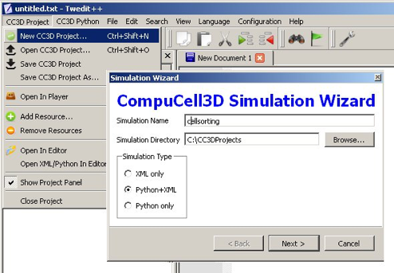
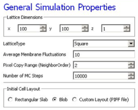
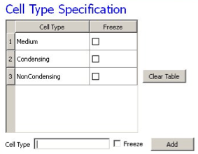
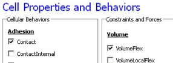
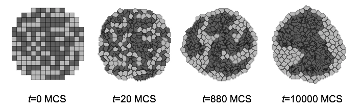

Cell Sorting Simulation
-------------------------

Cell sorting due to differential adhesion between cells of different types is one of the basic mechanisms creating tissue domains during development and wound healing and in maintaining domains in homeostasis. In a classic *in vitro* cell sorting experiment to determine relative cell adhesivities in embryonic tissues, mesenchymal cells of different types are dissociated, then randomly mixed and reaggregated. Their motility and differential adhesivities then lead them to rearrange to reestablish coherent homogenous domains with the most cohesive cell type surrounded by the less. The simulation of the sorting of two cell types was the original motivation for the development of GGH methods. Such simple simulations show that the final configuration depends only on the hierarchy of adhesivities, while the sorting dynamics depends on the ratio of the adhesive energies to the amplitude of cell fluctuations.

To invoke the simulation wizard to create a simulation, we click ``CC3DProject->New CC3D Project`` in the menu bar. In the initial screen we specify the name of the model (``cellsorting``), its storage directory (*C:\CC3DProjects*) and whether we will store the model as pure CC3DML, Python and CC3DML or pure Python. This tutorial will use Python and CC3DML.

    **Figure 7.:** Invoking the CompuCell3D Simulation Wizard from Twedit++

On the next page of the Wizard we specify GGH global parameters, including cell-lattice dimensions, the cell fluctuation amplitude, the duration of the simulation in Monte-Carlo steps and the initial cell-lattice configuration.

In this example, we specify a 100x100x1 cell-lattice, i.e., a 2D model, a fluctuation amplitude of 10, a simulation duration of 10000 MCS and a pixel-copy range of 2. ``BlobInitializer`` initializes the simulation with a disk of cells of specified size.

    **Figure 8.:** Specification of basic cell-sorting properties in Simulation Wizard

On the next Wizard page we name the cell types in the model. We will use two cells types: ``Condensing`` (more cohesive) and ``NonCondensing`` (less cohesive). CC3D by default includes a special generalized-cell type ``Medium`` with unconstrained volume which fills otherwise unspecified space in the cell-lattice.

    **Figure 9.:** Specification of cell-sorting cell types in Simulation Wizard.

We skip the Chemical Field page of the Wizard and move to the Cell Behaviors and Properties page. Here we select the biological behaviors we will include in our model. **Objects in CC3D have no properties or behaviors unless we specify then explicitly**. Since cell sorting depends on differential adhesion between cells, we select the Contact Adhesion module from the Adhesion section and give the cells a defined volume using the Volume Constraint module.

    **Figure 10.:** Selection of cell-sorting cell behaviors in Simulation Wizard.

We skip the next page related to Python scripting, after which Twedit++-CC3D generates the draft simulation code. Double clicking on ``cellsorting.cc3d`` opens both the CC3DML (*cellsorting.xml*) and Python scripts for the model. Because the CC3DML file contains the complete model in this example, we postpone discussion of the Python script. A CC3DML file has 3 distinct sections. The first, the *Lattice Section* (lines 2-7) specifies global parameters like the cell-lattice size. The *Plugin Section* (lines 8-30) lists all the plugins used, e.g. ``CellType`` and ``Contact``. The *Steppable Section* (lines 32-39) lists all steppables, here we use only ``BlobInitializer``. Following Simulation-Wizard-generated draft CC3DML (XML) code for cell-sorting-

.. code-block:: xml
   :linenos:

    <CompuCell3D version="3.6.0">
    <Potts>
     <Dimensions x="100" y="100" z="1"/>
     <Steps>10000</Steps>
     <Temperature>10.0</Temperature>
     <NeighborOrder>2</NeighborOrder>
    </Potts>

    <Plugin Name="CellType">
     <CellType TypeId="0" TypeName="Medium"/>
     <CellType TypeId="1" TypeName="Condensing"/>
     <CellType TypeId="2" TypeName="NonCondensing"/>
    </Plugin>

    <Plugin Name="Volume">
     <VolumeEnergyParameters CellType="Condensing"
        LambdaVolume="2.0" TargetVolume="25"/>
     <VolumeEnergyParameters CellType="NonCondensing"
        LambdaVolume="2.0" TargetVolume="25"/>
    </Plugin>

    <Plugin Name="CenterOfMass"/>

    <Plugin Name="Contact">
     <Energy Type1="Medium" Type2="Medium">10</Energy>
     <Energy Type1="Medium" Type2="Condensing">10</Energy>
     <Energy Type1="Medium" Type2="NonCondensing">10</Energy>
     <Energy Type1="Condensing"Type2="Condensing">10</Energy>
     <Energy Type1="Condensing" Type2="NonCondensing">10</Energy>
     <Energy Type1="NonCondensing" Type2="NonCondensing">10</Energy>
     <NeighborOrder>2</NeighborOrder>
    </Plugin>

    <Steppable Type="BlobInitializer">
     <Region>
      

      <Radius>20</Radius>
      <Width>5</Width>
      <Types>Condensing,NonCondensing</Types>
     </Region>
    </Steppable>
   </CompuCell3D>

**Listing 1:** Simulation-Wizard-generated draft CC3DML (XML) code for cell-sorting

Each CC3DML configuration file begins with the ``<CompuCell3D>`` tag and ends with the ``</CompuCell3D>`` tag. A CC3DML configuration file contains three sections in the following sequence: the *lattice section* (contained within the`` <Potts>`` tag pair), the *plugins section*, and the *steppables section*. The lattice section defines global parameters for the simulation: cell-lattice and field-lattice dimensions (specified using the syntax ``<Dimensions x="x_dim" y="y_dim" z="z_dim"/>``), the number of Monte Carlo Steps to run (defined within the ``<Steps>`` tag pair) the effective cell motility (defined within the ``<Temperature>`` tag pair) and boundary conditions. The default boundary conditions are *no-flux*. They can be changed to be periodic along the *x* and *y* axes by assigning the value ``Periodic`` to the ``<Boundary_x>`` and ``<Boundary_y>`` tag pairs. The value set by the ``<NeighborOrder>`` tag pair defines the range over which source pixels are selected for index-copy attempts (see Figure 4 and Table 1).

The plugins section lists the plugins the simulation will use. The syntax for all plugins which require parameter specification is:

.. code-block:: xml

  <Plugin Name="PluginName">
    <ParameterSpecification/>
  </Plugin>

The ``CellType`` plugin is quite special as it does not participate directly in index copies, but is used by other plugins for cell-type-to-cell-index mapping.It uses the parameter syntax

.. code-block:: xml

  <CellType TypeName="Name" TypeId="IntegerNumber"/>

to map verbose generalized-cell-type names to numeric cell ``TypeIds`` for all generalized-cell types. ``Medium`` (appearing in *Listing 1*)is a special cell type with unconstrained volume and surface area that fills all cell-lattice pixels unoccupied by cells of other types.

Steppables section consists of module declaration which follow the following patern:

.. code-block:: xml

 <Steppable Type="SteppableName" Frequency="FrequencyMCS">
   <ParameterSpecification/>
 </Steppable>

The Frequency attribute is optional  and by default is 1 MCS.

By autogenerating CC3DML code, Twedit++-CC3D releases user from remembering all the rules necessary to construct a valid CC3DML simulation script. All parameters appearing in the autogenerated CC3DML script have default values inserted by Simulation Wizard.
We must edit the parameters in the draft CC3DML script to build a functional cell-sorting model (*Listing 1*). The ``CellType`` plugin (lines 9-13) already provides three generalized-cell types: ``Condensing`` (C), ``NonCondensing`` (N) and ``Medium`` (M), so we need not change it.
However, the boundary-energy (Contact-energy) matrix in the ``Contact`` plugin (lines 22-30) is initially filled with identical values, i.e., the cell types are identical. For cell-sorting, ``Condensing`` cells must adhere strongly to each other (so we set J\ :sub:`CC`\ = 2), ``Condensing`` and ``NonCondensing`` cells must adhere more weakly (here we set J\ :sub:`CN`\ = 11) and all other adhesion must be very weak (we set J\ :sub:`NN`\ = J\ :sub:`CM`\ = J :sub:`NM`\ = 16), as discussed in section. The value of J\ :sub:`MM`\  =0 is irrelevant, since the Medium generalized cell does not contact itself.
To reduce artifacts due to the anisotropy of the square cell-lattice we increase the neighbor-order range in the contact energy to 2 so the contact-energy sum in equation () will include nearest and second-nearest neighbors (line 29).

In the ``Volume`` plugin, which calculates the Volume-constraint energy given in equation the attributes ``CellType``, ``LambdaVolume`` and ``TargetVolume`` inside the ``<VolumeEnergyParameters>`` tags specify  :math:`\lambda(\tau)` and :math:`V_t(\tau)` for each cell type. In our simulations we set :math:`V_t(\tau) = 25` and :math:`\lambda(\tau) = 2.0` for both cell types.
We initialize the cell lattice using the ``BlobInitializer``, which creates one or more disks (solid spheres in 3D) of cells. Each region is enclosed between`` <Region>`` tags. The`` 
`` tag with syntax ``
`` specifies the position of the center of the disk. The`` <Width>`` tag specifies the size of the initial square (cubical in 3D) generalized cells and the ``<Gap>`` tag creates space between neighboring cells. The ``<Types>`` tag lists the cell types to fill the disk. Here, we change the Radius in the draft  ``BlobInitializer`` specification to 40. These few changes produce a working cell-sorting simulation.
To run the simulation we right click *cellsorting.cc3d* in the left panel and choose the *Open In Player option*. We can also run the simulation by opening CompuCellPlayer and selecting *cellsorting.cc3d* from the *File-> Open Simulation File…* dialog.

Figure 11 shows snapshots of a simulation of the cell-sorting model. The less cohesive ``NonCondensing`` cells engulf the more cohesive ``Condensing`` cells, which cluster and form a single central domain. By changing the boundary energies we can produce other cell-sorting patterns. In particular, if we reduce the contact energy between the ``Condensing`` cell type and the ``Medium``, we can force inverted cell sorting, where the ``Condensing`` cells surround the ``NonCondensing`` cells. If we set the heterotypic contact energy to be less than either of the homotypic contact energies, the cells of the two types will mix rather than sort. If we set the cell-medium contact energy to be very small for one cell type, the cells of that type will disperse into the medium, as in cancer invasion. With minor modifications, we can also simulate the scenarios for three or more cell types, for situations in which the cells of a given type vary in volume, motility or adhesivity, or in which the initial condition contains coherent clusters of cells rather than randomly mixed cells (engulfment).

    **Figure 11.:** Snapshots of the cell-lattice configurations for the cell-sorting simulation in Listing 1. The boundary-energy hierarchy drives ``NonCondensing`` (light grey) cells to surround ``Condensing`` (dark grey) cells. The white background denotes surrounding ``Medium``
