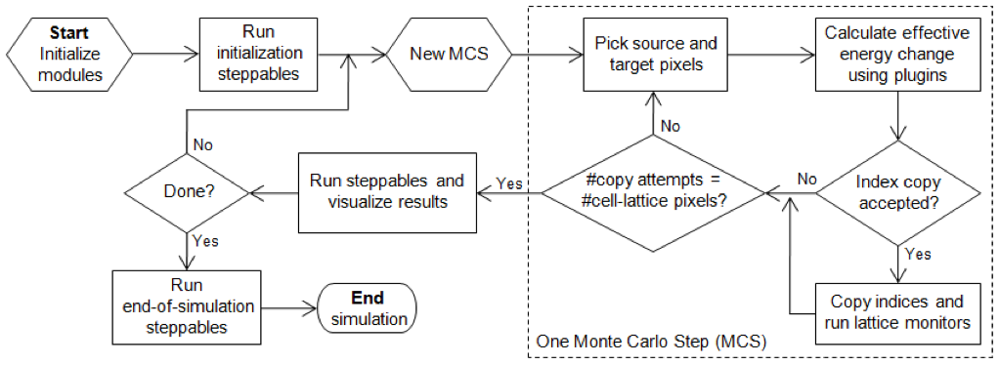
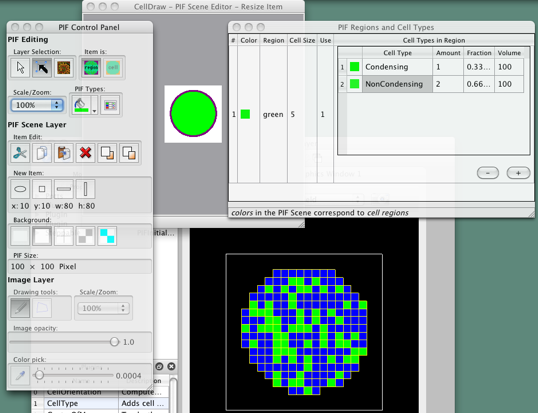

CompuCell3D
=============

CompuCell3D allows users to build sophisticated models more easily and quickly than does specialized custom code. It also facilitates model reuse and sharing.
A CC3D model consists of CC3DML scripts (an XML-based format), Python scripts, and files specifying the initial configurations of any fields and the cell lattice. The CC3DML script specifies basic GGH parameters such as lattice dimensions, cell types, biological mechanisms and auxiliary information such as file paths.

    **Figure 5.:** Flow chart of the GGH algorithm as implemented in CompuCell3D

Python scripts primarily monitor the state of the simulation and implement changes in cell behaviors, e.g. changing the type of a cell depending on the oxygen partial pressure in a simulated tumor.

CompuCell3D is modular, loading only the modules needed for a particular model. Modules which calculate effective energy terms or monitor events on the cell lattice are called plugins. Effective-energy calculations are invoked every pixel copy attempt, while cell-lattice monitoring plugins run whenever an index copy occurs. Because plugins are the most frequently called modules in CC3D, most are coded in C++ for speed.

Modules called steppables usually performs operations on cells, not on pixels. Steppables are called at fixed intervals measured in Monte-Carlo steps. Steppables have three main uses: 1) to adjust cell parameters in response to simulation events [#f1]_, 2) to solve PDEs, 3) to load simulation initial conditions or save simulation results. Most steppables are implemented in Python. Much of the flexibility of CC3D comes from user-defined Python steppables.
The CC3D kernel supports parallel computation in shared-memory architectures (via OpenMP), providing substantial speedups on multi-core computers.

Besides the computational kernel of CC3D, the main components of the CC3D environment are: 1) Twedit++-CC3D – a model editor and code generator, 2) CellDraw – a graphical tool for configuring the initial cell lattice, 3) CC3D Player – a graphical tool for running, replaying and analyzing simulations.

Twedit++-CC3D provides a Simulation Wizard which generates draft CC3D model code based on high-level specification of simulation objects such as cell types and their behaviors, fields and interactions. Currently, the user must adjust default parameters in the auto-generated draft code, but later versions will provide interfaces for parameter specification. Twedit++-CC3D also provides a Python code-snippet generator, which simplifies coding Python CC3D modules.

CellDraw allows users to draw regions which it fills with cells of user-specified types. It also imports microscope images for manual segmentation.

CC3D Player is a graphical interface which loads and executes CC3D models. It allows users to change model parameters during execution (steering), define multiple 2D and 3D visualizations of the cell lattice and fields and conduct real-time simulation analysis. CC3D Player also supports batch mode execution on clusters.

    **Figure 6.:** CellDraw graphics tools and GUI

.. [#f1] We will use the word model to describe the specification of a particular biological system and simulation to refer to a specific instance of the execution of such a model.
