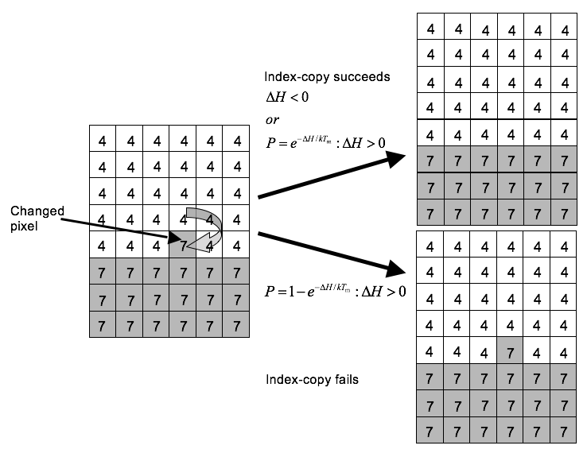

Dynamics
---------

A GGH simulation consists of many attempts to copy cell indices between neighboring pixels. In CompuCell3D the default dynamical algorithm is *modified Metropolis dynamics*. During each index-copy attempt, we select a *target* pixel, :math:`i`, randomly from the cell lattice, and then randomly select one of its neighboring pixels, :math:`i'`, as a source pixel. If they belong to the same generalized cell (i.e., if :math:`\sigma(i) = \sigma(i')`) we do not need copy index. Otherwise the cell containing the source pixel attempts to occupy the target pixel. Consequently, a successful index copy increases the volume of the *source* cell and decreases the volume of the *target* cell by one pixel.

    **Figure 2.:** GGH representation of an index-copy attempt for two cells on a 2D square lattice – The “white” pixel (source) attempts to replace the “grey” pixel (target). The probability of accepting the index copy is given by :eq:`(7)`.

In the modified Metropolis algorithm we evaluate the change in the total effective energy due to the attempted index copy and accept the index-copy attempt with probability:

.. math:: P(\sigma(i)\rightarrow\sigma(i')) = \{exp(-\Delta H/T_m : \Delta H > 0; 1:\Delta H \leq 0)\}
  :label: (7)

where :math:`T_m` is a parameter representing the *effective cell motility* (we can think of :math:`T_m` as the amplitude of cell-membrane fluctuations). Equation :eq:`(7)` is the Boltzmann acceptance function. Users can define other acceptance functions in CompuCell3D. The conversion between MCS and experimental time depends on the average values of . MCS and experimental time are proportional in biologically-meaningful situations [87]-[90].
