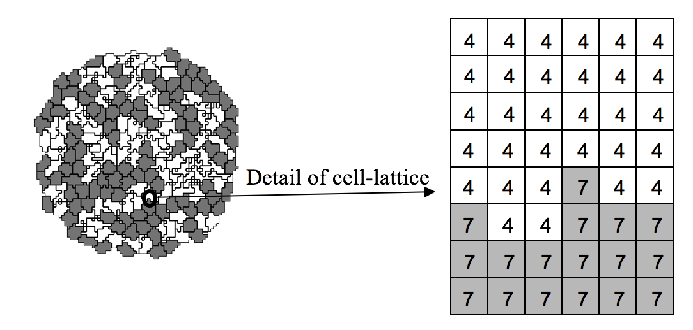

Introduction
=============

The last decade has seen fairly realistic simulations of single cells that can confirm or predict experimental findings. Because they are computationally expensive, they can simulate at most several cells at once. Even more detailed subcellular simulations can replicate some of the processes taking place inside individual cells. E.g., Virtual Cell (http://www.nrcam.uchc.edu) supports microscopic simulations of intracellular dynamics to produce detailed replicas of individual cells, but can only simulate single cells or small cell clusters.

Simulations of tissues, organs and organisms present a somewhat different challenge: how to simplify and adapt single cell simulations to apply them efficiently to study, *in-silico*, ensembles of several million cells. To be useful, these simplified simulations should capture key cell-level behaviors, providing a phenomenological description of cell interactions without requiring prohibitively detailed molecular-level simulations of the internal state of each cell. While an understanding of cell biology, biochemistry, genetics, *etc*. is essential for building useful, predictive simulations, the hardest part of simulation building is identifying and quantitatively describing appropriate subsets of this knowledge. In the excitement of discovery, scientists often forget that modeling and simulation, by definition, require simplification of reality.

One choice is to ignore cells completely, e.g., Physiome [1] models tissues as continua with bulk mechanical properties and detailed molecular reaction networks, which is computationally efficient for describing dense tissues and non-cellular materials like bone, extracellular matrix (ECM), fluids, and diffusing chemicals [2][3], but not for situations where cells reorganize or migrate.

    **Figure1:** Detail of a typical two-dimensional GGH cell-lattice configuration. Each colored domain represents a single spatially-    extended cell. The detail shows that each generalized cell is a set of cell-lattice sites (or pixel), , with a unique index, :math:`\sigma_(i)` , here 4 or 7. The color denotes the cell type,  .

Multi-cell simulations are useful to interpolate between single-cell and continuum-tissue extremes because cells provide a natural level of abstraction for simulation of tissues, organs and organisms (4). Treating cells phenomenologically reduces the millions of interactions of gene products to several behaviors: most cells can move, divide, die, differentiate, change shape, exert forces, secrete and absorb chemicals and electrical charges, and change their distribution of surface properties. The *Glazier-Graner-Hogeweg (GGH)* approach facilitates multiscale simulations by defining spatially-extended *generalized cells*, which can represent clusters of cells, single cells, sub-compartments of single cells or small subdomains of non-cellular materials. This flexible definition allows tuning of the level of detail in a simulation from intracellular to continuum without switching simulation framework to examine the effect of changing the level of detail on a macroscopic outcome, e.g., by switching from a coupled ordinary-differential-equation (ODE) Reaction-Kinetics (RK) model of gene regulation to a Boolean description or from a simulation that includes subcellular structures to one that neglects them.
